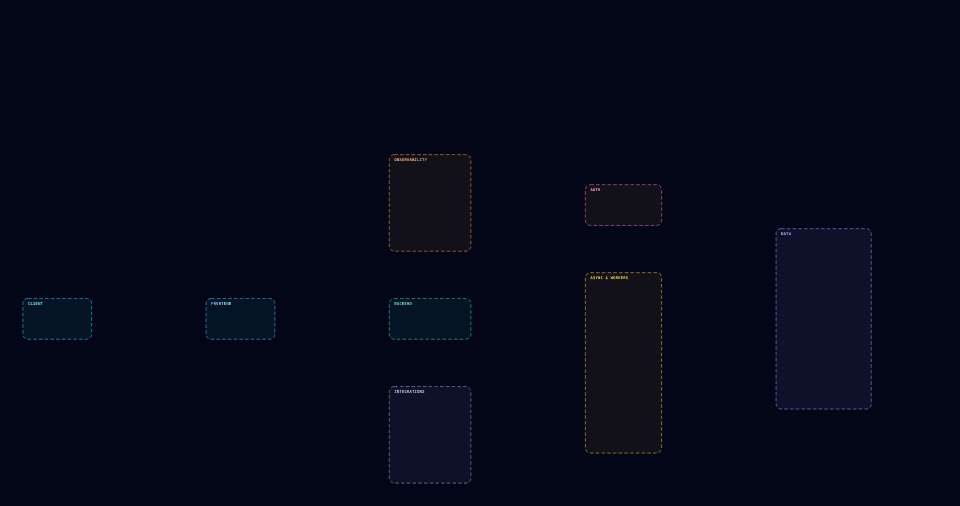
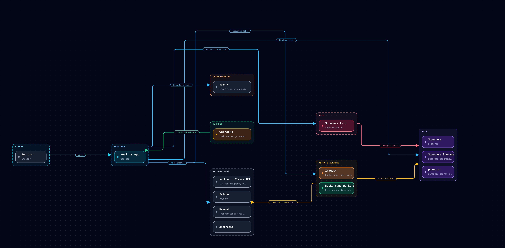

# Samplerepo — Architecture

> **Living documentation** — Generated from your connected repository and kept in sync via Repona webhooks. Commit this file for a repo-local snapshot; the [live diagram](http://localhost:3000/share/ROTvMWVoC0_we_MobT6ZmeFjVf8P2lJY) always reflects the latest codebase.

_Exported Aug 5, 2026, 9:44 AM. Re-export from Repona after major changes to refresh this file._

## Overview

Next.js on Vercel with Supabase data/auth, Inngest workers for repo scans and exports, Claude for AI, and Paddle billing — derived from project documentation.

[Open interactive diagram in Repona](http://localhost:3000/share/ROTvMWVoC0_we_MobT6ZmeFjVf8P2lJY)

## Components

### End User

**Type:** external

Shopper

### Webhooks

**Type:** gateway

Push and merge event…

### pgvector

**Type:** database

Semantic search exte…

### Playwright

**Type:** service

Headless capture for…

### FFmpeg

**Type:** service

Video encoding for d…

### UptimeRobot

**Type:** external

Uptime monitoring

### Next.js App

**Type:** frontend

Web app

### Supabase

**Type:** database

Postgres

### Inngest

**Type:** queue

Background jobs, ret…

### Anthropic Claude API

**Type:** external

LLM for diagrams, Q&…

### Supabase Auth

**Type:** security

Authentication

### Redis

**Type:** cache

Rate limiting, cachi…

### Background Workers

**Type:** service

Repo scans, diagram…

### Paddle

**Type:** external

Payments

### Supabase Storage

**Type:** storage

Exported diagrams, v…

### Resend

**Type:** external

Transactional email…

### Sentry

**Type:** external

Error monitoring and…

### PostHog

**Type:** external

Product analytics an…

### Supabase Realtime

**Type:** service

Live notifications a…

### Diagram Renderer

**Type:** service

Deterministic JSON-t…

### Postgres Full-Text Search

**Type:** database

Keyword search acros…

### Static Analysis

**Type:** service

Deterministic struct…

## Connections

- End User → Next.js App — _Uses app_
- Next.js App → Supabase Auth — _Authenticates via_
- Supabase Auth → Supabase — _Manages users_
- Next.js App → Supabase — _Reads/writes_
- Next.js App → Redis — _Cache & rate limits_
- Next.js App → Supabase Storage — _Stores exports_
- Next.js App → pgvector — _Semantic search_
- Next.js App → Postgres Full-Text Search — _Keyword search_
- Next.js App → Anthropic Claude API — _AI requests_
- Next.js App → Paddle — _Billing_
- Next.js App → Diagram Renderer — _Renders diagrams_
- Webhooks → Next.js App — _Verified webhook_
- Next.js App → Inngest — _Enqueues jobs_
- Inngest → Background Workers — _Runs jobs_
- Background Workers → Anthropic Claude API — _Analyzes code_
- Background Workers → Static Analysis — _Structural diff_
- Background Workers → Diagram Renderer — _JSON to SVG_
- Background Workers → Supabase — _Saves version_
- Background Workers → Playwright — _Captures frames_
- Playwright → FFmpeg — _Encodes video_
- FFmpeg → Supabase Storage — _Uploads export_
- Background Workers → Supabase Realtime — _Publishes updates_
- Supabase Realtime → Next.js App — _Live notifications_
- Next.js App → Resend — _Transactional email_
- Inngest → Resend — _Digest emails_
- Next.js App → Sentry — _Reports errors_
- Next.js App → PostHog — _Analytics events_
- UptimeRobot → Next.js App — _Monitors uptime_
- Next.js App → Playwright — _calls_
- Playwright → Supabase — _reads/writes_
- Playwright → Paddle — _creates transaction_

## Design decisions

### scaling issue

**Component:** Background Workers

I dont know .

---

Maintained with [Repona](https://repona.app) — living architecture documentation aligned with your codebase.
